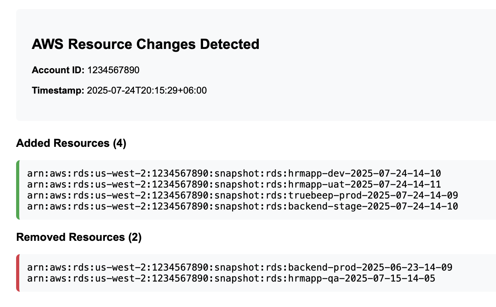

# AWS Resource Watcher

A Go daemon that continuously monitors AWS resources across all regions and sends notifications when resources are added or removed.

## Screenshot



## Installation

### 1. Run using Docker

You can run the AWS Resource Watcher using the pre-built Docker image from GitHub Container Registry:

```bash
# Pull the latest image
docker pull ghcr.io/mdminhazulhaque/aws-resource-watcher:latest

# Create environment file
cp .env.example .env
# Edit .env with your configuration

# Run with Docker Compose
docker-compose up -d

# Or run directly with Docker
docker run -d \
  --name aws-resource-watcher \
  --env-file .env \
  ghcr.io/mdminhazulhaque/aws-resource-watcher:latest
```

### 2. Kubernetes Deployment

Deploy to any Kubernetes cluster using Kustomize:

```bash
# Clone the repository
git clone https://github.com/mdminhazulhaque/aws-resource-watcher.git
cd aws-resource-watcher

# Update configuration in k8s/configmap.yaml
# Configure your environment variables

# Deploy using Kustomize
kubectl apply -k k8s/
```

### 3. EKS with IRSA (Recommended)

For AWS EKS clusters, use IAM Roles for Service Accounts (IRSA) for secure AWS authentication:

```bash
# Set your cluster details
CLUSTER_NAME="your-cluster-name"
REGION="us-east-1"
ACCOUNT_ID=$(aws sts get-caller-identity --query Account --output text)

# Create IAM role and service account with required permissions
eksctl create iamserviceaccount \
    --name aws-resource-watcher \
    --namespace default \
    --cluster $CLUSTER_NAME \
    --region $REGION \
    --attach-policy-arn arn:aws:iam::aws:policy/ResourceGroupsandTagEditorReadOnlyAccess \
    --attach-policy-arn arn:aws:iam::aws:policy/AmazonEC2ReadOnlyAccess \
    --attach-policy-arn arn:aws:iam::aws:policy/AmazonSESFullAccess \
    --approve

# Deploy the application
kubectl apply -k k8s/

# Verify deployment
kubectl logs -f deployment/aws-resource-watcher -n default
```

## Configuration

All configuration is done through environment variables:

| Variable | Description | Required | Default |
|----------|-------------|----------|---------|
| `AWS_REGION` | Default AWS region | No | us-east-1 |
| `AWS_ACCESS_KEY_ID` | AWS Access Key ID | No* | - |
| `AWS_SECRET_ACCESS_KEY` | AWS Secret Access Key | No* | - |
| `AWS_ROLE_ARN` | IAM Role ARN to assume | No* | - |
| `REGIONS_INCLUDE` | Comma-separated list of regions to include | No | - |
| `REGIONS_EXCLUDE` | Comma-separated list of regions to exclude | No | - |
| `REDIS_URI` | Redis connection URI | Yes | - |
| `SLEEP_INTERVAL_SECONDS` | Sleep interval between checks in seconds | No | 300 |
| `ARN_IGNORE_PATTERNS` | Comma-separated ARN patterns to ignore | No | - |
| `MAIL_DRIVER` | Email delivery method (`smtp` or `ses`) | No | smtp |
| `MAIL_FROM` | From email address | Yes | - |
| `MAIL_RECIPIENTS` | Comma-separated list of recipient emails | Yes | - |
| `MAIL_REGION` | AWS region for SES (when using SES driver) | No | AWS_REGION |
| `SMTP_HOST` | SMTP server hostname | Yes | - |
| `SMTP_PORT` | SMTP server port | No | 587 |
| `SMTP_USERNAME` | SMTP username | Yes | - |
| `SMTP_PASSWORD` | SMTP password | Yes | - |
| `SMTP_USE_TLS` | Use TLS for SMTP connection | No | true |

*AWS credential variables are optional if the daemon can auto-detect credentials (EC2 roles, EKS IRSA, etc.)

## AWS Permissions

The AWS credentials/role must have the following permissions:

```json
{
    "Version": "2012-10-17",
    "Statement": [
        {
            "Effect": "Allow",
            "Action": [
                "sts:GetCallerIdentity",
                "ec2:DescribeRegions",
                "resourcegroupstaggingapi:GetResources"
            ],
            "Resource": "*"
        },
        {
            "Effect": "Allow",
            "Action": [
                "ses:SendEmail",
                "ses:SendRawEmail"
            ],
            "Resource": "*"
        }
    ]
}
```

## License

This project is licensed under the MIT License - see the [LICENSE](LICENSE) file for details.